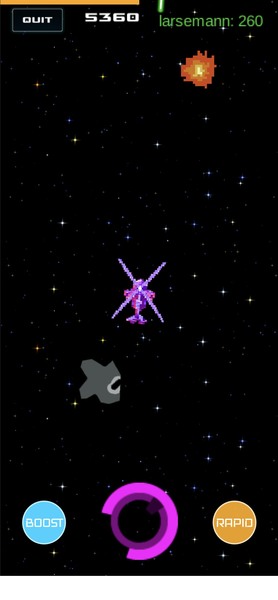

# SpaceChoppers Multiplayer Game

Welcome to the Space Choppers multiplayer game for Android! Developed as part of the TDT4240 Software Architecture course in the spring semester of 2023 at the Norwegian University of Science and Technology (NTNU). In this game, you will be able to compete with friends to get the highest score traveling with your chopper through space. SpaceChoppers is developed using the LibGDX framework.

 

This README file will guide you through the process of running and building the SpaceChoppers game in Android Studio.

## Table of Contents

1. Prerequisites
2. Running the App in Android Studio
3. Building with Gradle
4. Known Bugs

## 1. Prerequisites

Before you start, make sure you have the following software installed on your system:

- Android Studio (version 4.0 or higher)
- Java Development Kit (JDK) 8
- Android SDK (API Level 29 or higher)
- Gradle (version 6.1.1 or higher)
- Kotlin (version 1.3.41 or higher)

## 2. Running the App in Android Studio

To run the app in Android Studio, follow these steps:

1. Clone the SpaceChoppers repository to your local machine using Git SSH:

```
git clone git@github.com:oskarhlm/TDT4240-SpaceChoppers.git
```

2. Open Android Studio and select "Open an existing Android Studio project" from the welcome screen.

3. Browse to the TDT4240-SpaceChoppers/SpaceChoppers directory you cloned in step 1 and click "Open".

4. Wait for the Android Studio to sync the project and resolve any dependencies.

5. Connect your Android device to your computer or create a new Android Virtual Device (AVD) using the AVD Manager.

6. In the toolbar, select the device you want to run the app on from the device dropdown.

7. Click the green "Run" button (a triangle icon) or press `Shift + F10` to build and run the app on the selected device.

## 3. Building with Gradle

Gradle is the default build system for Android projects and is used to build and package the SpaceChoppers game. You can build the game using the command line or Android Studio.

### 3.1 Building with the Command Line

To build the app using the command line, follow these steps:

1. Open a terminal or command prompt and navigate to the root directory of the SpaceChoppers project.

2. Run the following command to build the app:

```
./gradlew `filename`
```

3. Wait for the build to complete. The generated APK file will be located in the `SpaceChoppers/android/build/outputs/apk/` directory.

### 3.2 Building with Android Studio

To build the app using Android Studio, follow these steps:

1. Open the SpaceChoppers project in Android Studio.

2. Click "Build" in the menu bar and then click "Build Bundle(s) / APK(s)" > "Build APK(s)".

3. Wait for the build to complete. The generated APK file will be located in the `SpaceChoppers/android/build/outputs/apk/` directory.

## 4. Known Bugs

- If our servers are down or you are somehow not able to establish a websocket connection, the game will not start.
- If you pass an invalid lobby ID when trying to join a game, the game will provide an error.
